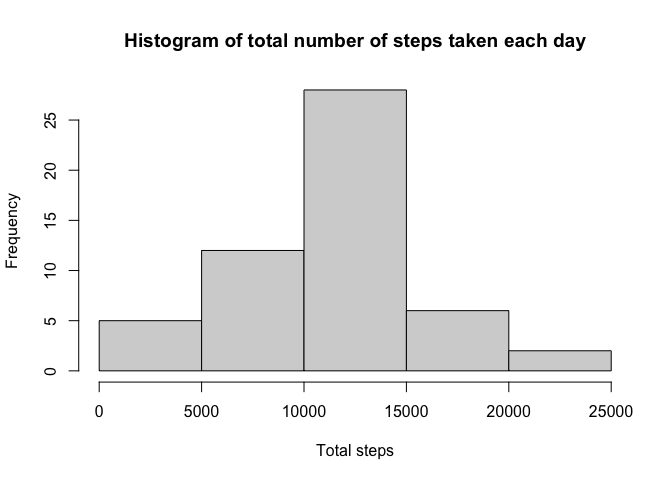
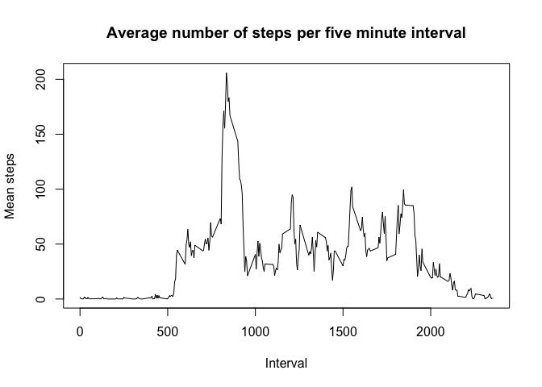
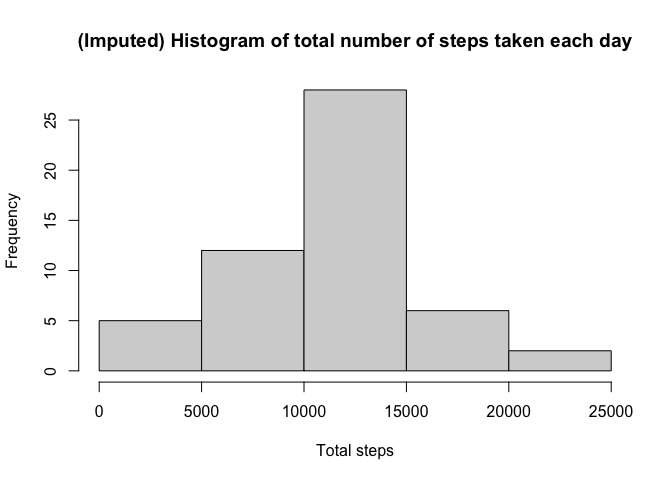
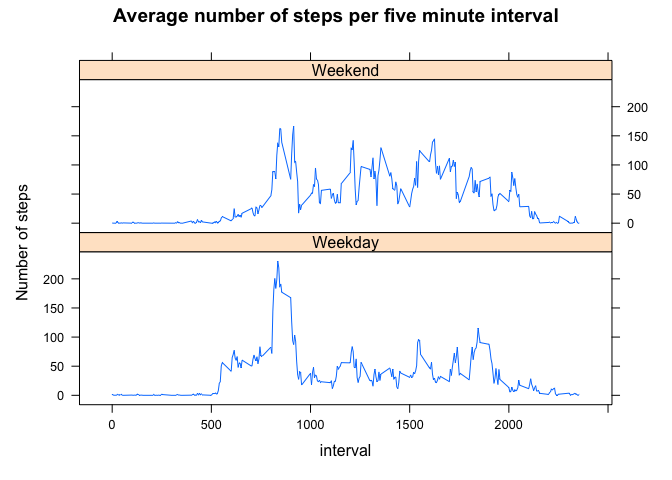

This is my submission for Week 2 Course Project 1

## 1. Loading and preprocessing the data

The appropriate packages to be used throughout the assignment were loaded. To load the data read.csv() was used. The class of the date variable was converted to date using as.Date(). The data is now ready to use. 


```r
library(dplyr)
library(lattice)
```


```r
Data <- read.csv("activity.csv", header = TRUE, na.strings = "NA")
Data$date <- as.Date(Data$date)
head(Data)
```

```
##   steps       date interval
## 1    NA 2012-10-01        0
## 2    NA 2012-10-01        5
## 3    NA 2012-10-01       10
## 4    NA 2012-10-01       15
## 5    NA 2012-10-01       20
## 6    NA 2012-10-01       25
```

## 2. What is mean total number of steps taken per day?

The data was grouped by date using group_by(). The sum of steps for each day was calculated using summarise().


```r
dategroup <- group_by(Data, date)
stepdatesummary <- summarise(dategroup, total_steps = sum(steps))
head(stepdatesummary)
```

```
## # A tibble: 6 × 2
##   date       total_steps
##   <date>           <int>
## 1 2012-10-01          NA
## 2 2012-10-02         126
## 3 2012-10-03       11352
## 4 2012-10-04       12116
## 5 2012-10-05       13294
## 6 2012-10-06       15420
```
A histogram can then be created using this grouped data.


```r
hist(stepdatesummary$total_steps, xlab = "Total steps", main = "Histogram of total number of steps taken each day")
```

<!-- -->

The mean can be found...


```r
mean(stepdatesummary$total_steps, na.rm = TRUE)
```

```
## [1] 10766.19
```
The median too...

```r
median(stepdatesummary$total_steps, na.rm = TRUE)
```

```
## [1] 10765
```

## 3. What is the average daily activity pattern?

The data was grouped by interval using groupby(). The mean number of steps was calculated for each interval using summary. 


```r
timeinterval <- group_by(Data, interval)
timeintervalsummary <- summarise(timeinterval, Mean_steps = mean(steps, na.rm = TRUE))
head(timeintervalsummary)
```

```
## # A tibble: 6 × 2
##   interval Mean_steps
##      <int>      <dbl>
## 1        0     1.72  
## 2        5     0.340 
## 3       10     0.132 
## 4       15     0.151 
## 5       20     0.0755
## 6       25     2.09
```

A time series plot was created of the 5 minute interval and the average number of steps taken, averaged across all days. 


```r
with(timeintervalsummary, plot(interval, Mean_steps, type = "l", xlab = "Interval", ylab = "Mean steps", main = "Average number of steps per five minute interval"))
```

<!-- -->

To calculate the interval that had the highest mean number of steps, the max function was used as an argument within the filter function. 


```r
timeintervalsummary %>% filter(Mean_steps==max(Mean_steps)) 
```

```
## # A tibble: 1 × 2
##   interval Mean_steps
##      <int>      <dbl>
## 1      835       206.
```
## 4. Imputing missing values

The number of missing values within the dataset was calculated.


```r
sum(is.na(Data$steps))
```

```
## [1] 2304
```

A new dataset needed to be created with the missing values filled in. The missing values were replaced with the mean steps value for that interval.

This changes each interval to the total mean number of steps for the grouped intervals.

Match() returns the positions of the first occurance in which the intervals match. Hence, each subsequently repeated interval, will return the position of the first interval it matched. As each interval is grouped in timeintervalsummary, each interval is only listed once. The positions are not grouped in Data, hence the same interval values will have the same matched position in timeintervalsummary. We then subset the Mean_steps from timeintervalsummary using the matched interval positions, and this will return the mean steps for each of the positions. This is stored as a sequence of numbers in imputedsteps. 


```r
imputedsteps <- timeintervalsummary$Mean_steps[match(Data$interval, timeintervalsummary$interval)]
```

Next, we transform the original data to replace the NAs with the mean number of steps for that interval. If else is used as follows: if there is an NA value in the steps variable of Data, we will use the value from imputedsteps instead, if it is not NA it will remain the same. 


```r
imputeddata <- transform(Data, steps = ifelse(is.na(Data$steps), yes = imputedsteps, no = Data$steps))
```

The new imputeddata is once again grouped by date using group_by(). The sum of steps for each day was calculated using summarise().


```r
imputeddatagroup <- group_by(imputeddata, date)
imputeddatasummary <- summarise(imputeddatagroup, total_steps = sum(steps))
head(imputeddatasummary)
```

```
## # A tibble: 6 × 2
##   date       total_steps
##   <date>           <dbl>
## 1 2012-10-01      10766.
## 2 2012-10-02        126 
## 3 2012-10-03      11352 
## 4 2012-10-04      12116 
## 5 2012-10-05      13294 
## 6 2012-10-06      15420
```

We can then make a histogram....


```r
hist(stepdatesummary$total_steps, xlab = "Total steps", main = "(Imputed) Histogram of total number of steps taken each day")
```

<!-- -->

We can then observe whether there is a difference in results when calculating basic statistics between the original data with its NA values and the imputed data. 


```
##        Original  Imputed
## Mean   10766.19 10766.19
## Median 10765.00 10766.19
```

The median of the imputed data increases to 10766.19, the mean remains the same. 


## Are there differences in activity patterns between weekdays and weekends?

The imputed data is used, and a new factor variable called week is created. If else is used as follows: if within the date variable, there is a saturday or a sunday, we will assign that as "Weekend" in the week variable, else it will be assigned as "Weekday". The weekdays() function is used here as it expresses each date as a day of the week. 


```r
imputeddata$week <- as.factor(ifelse(weekdays(Data$date) %in% c("Saturday", "Sunday"), yes = "Weekend", no =  "Weekday"))
```

The data is grouped by interval, and weekend or weekday using groupby(). The total mean steps for each interval and weekend or weekday is calculated using summarise.


```r
weektimeinterval <- group_by(imputeddata, interval, week)
weektimeintervalsummary <- summarise(weektimeinterval, Mean_steps = mean(steps, na.rm = TRUE))
head(weektimeintervalsummary)
```

```
## # A tibble: 6 × 3
## # Groups:   interval [3]
##   interval week    Mean_steps
##      <int> <fct>        <dbl>
## 1        0 Weekday     2.25  
## 2        0 Weekend     0.215 
## 3        5 Weekday     0.445 
## 4        5 Weekend     0.0425
## 5       10 Weekday     0.173 
## 6       10 Weekend     0.0165
```

A panel plot containing a time series plot of the 5-minute interval and the average number of steps taken, averaged across all weekday days or weekend days is created. Lattice is used here. A seperate panel is made for weekdays and weekends.


```r
xyplot(Mean_steps ~ interval | week, weektimeintervalsummary, layout = c(1,2), type = "l", ylab = "Number of steps", main = "Average number of steps per five minute interval")
```

<!-- -->

## Variable list

This is not required for the assignment but it is included for reference: <p>

Data: The original data as loaded by read.csv. The date class was converted to date using as.Date. <br>
dategroup: The data is grouped by date. <br>
stepdatesummary: The sum of steps for each day. <br> 
timeinterval: The data is grouped by interval. <br>
timeintervalsummarey: The mean of total steps for each interval. <br>
imputedsteps: A sequence of mean values that contain the mean value for each interval. <br>
imputeddata: The data with its missing steps values replaced with the mean value for each interval. <br>
imputeddatagroup: The imputed data grouped by date. <br>
imputeddatagroupsummary: The mean of total steps for each interval using imputed data. <br>
weektimeinterval: The imputed data grouped by interval and weekday/weekend <br>
weektimeintervalsummary: The sum of steps for each interval for weekday/weekend. <br>

